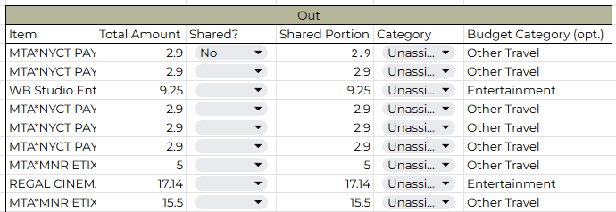
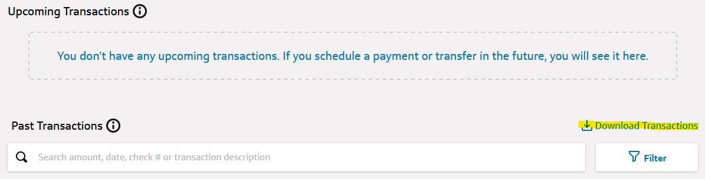

# BudgetWriter
Automatically export your credit card transactions to your budget spreadsheet.



## Getting Started

All you need is your own copy of the Budget Spreadsheet and a Python installation to begin.

### Prerequisites

Enable the GoogleSheets API for your account to allow Python to edit your sheets. Follow Google's [quickstart guide](https://developers.google.com/sheets/api/quickstart/python).

### Installation

1. Clone the repo (or simply just download this folder).
   ```sh
   git clone https://github.com/efamous02/BudgetSheet.git
   ```
2. Install the required Python packages (currently just google's API)
   ```sh
   pip install BudgetWriter/requirements.txt
   ```

## Usage
```sh
python budgetwriter.py 1yzv8m7ZExaLlwu3XbiatQwmaKW3rqQSLVx-lquhhiI8 -f "Capital One" 2024-04-23_transaction_download.csv -f Discover Discover-Statement-20240410.csv
```

This program only needs the ID of your budget spreadsheet and the files you want to import to it.

1. Get your budget spreadsheet ID by copying the gibberish-looking string from the middle of the google sheets link. See the highlighted portion below for an example ID.


Include the ID __first__ after the program name when running from the command line.

2. Download your transactions from your credit card/bank providers. You can find often get this by clicking the "Download Transactions" button or by opening a statement and saving it.
It is important that you **save them as a CSV.**
It is also highly recommended to save transactions from clear periods of time (eg all transactions in a certain month, or within another date range), to prevent adding multiple transactions repeatedly when downloading new files.


For every file you want to add, put it in the terminal with the `-f` flag using the format `-f "Provider Name" path-to-csv`. Reference the **Supported Providers** section for valid provider names and services you can automatically add your transactions from.

## Supported Providers
- Capital One
- Discover
